# AR Try On Glasses
## Overview

This project allows users to virtually try on different pairs of glasses using Augmented Reality.

## Features

*   Real-time virtual glasses overlay
*   Selection of different glasses models

## Getting Started

## Try it Out!

You can directly try the application on your Android device by downloading and installing the **frameXperience.apk** file.

## Demo Video:
https://www.youtube.com/watch?v=77nya6C8xmM

## App Screenshots:
<table>
  <tr>
    <td>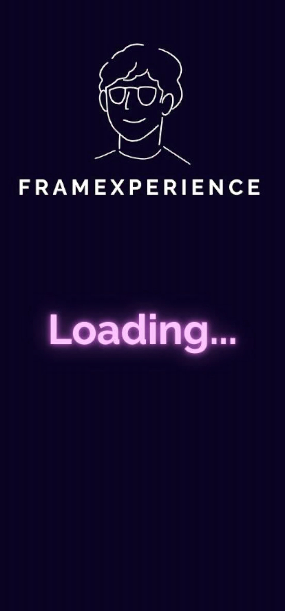</td>
    <td></td>
    <td>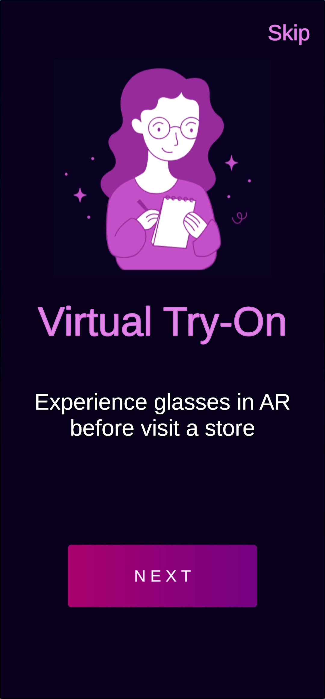</td>
    <td>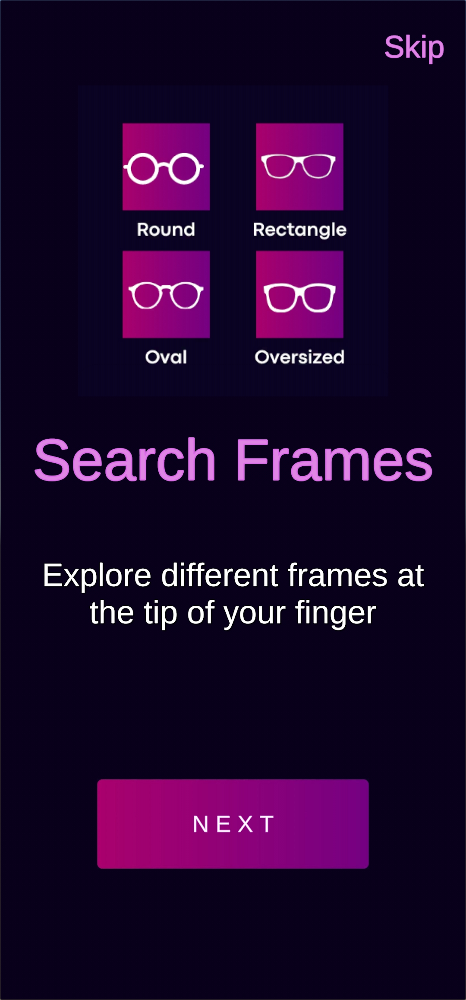</td>
  </tr>
</table>
<table>
  <tr>
    <td></td>
    <td>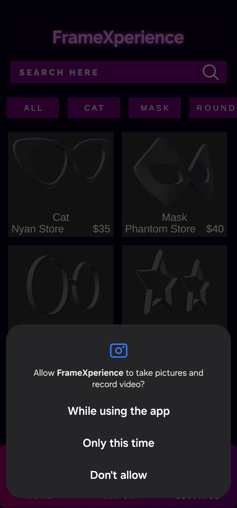</td>
    <td>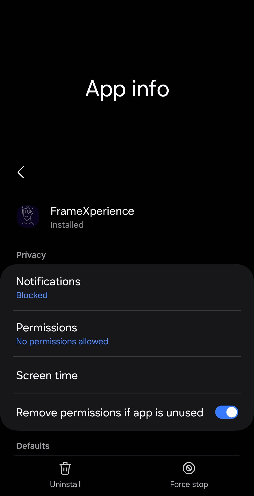</td>
    <td>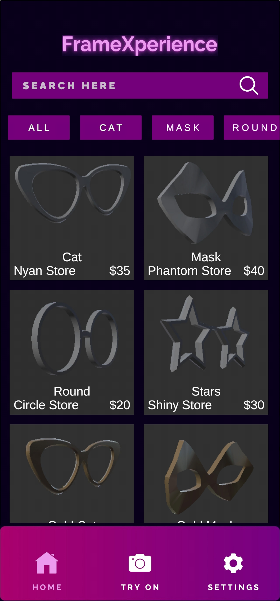</td>
  </tr>
</table>
<table>
  <tr>
    <td>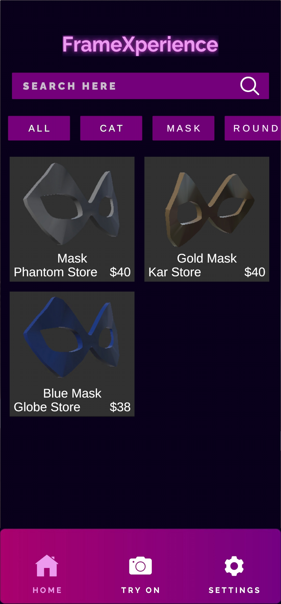</td>
    <td>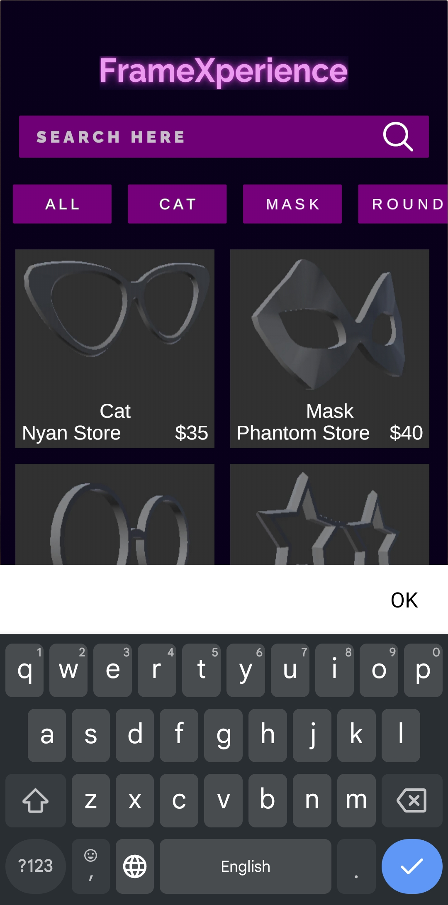</td>
    <td>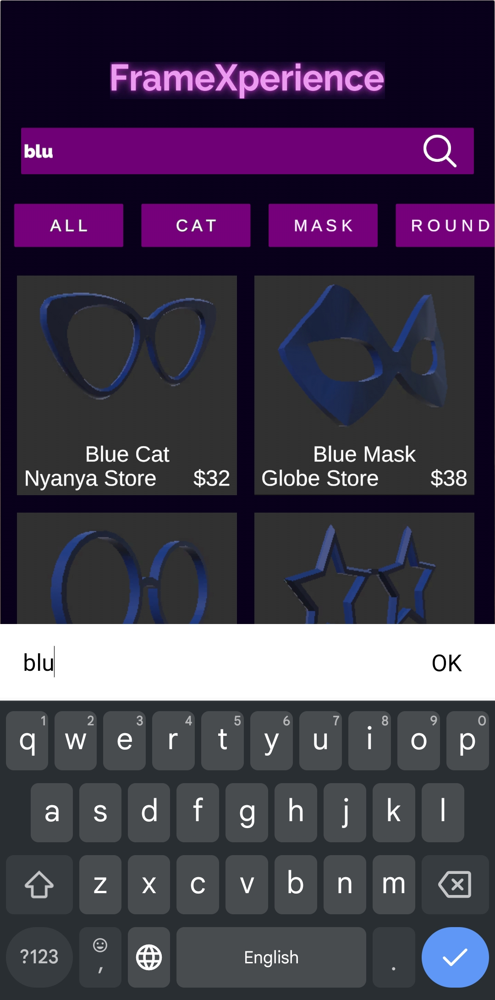</td>
    <td>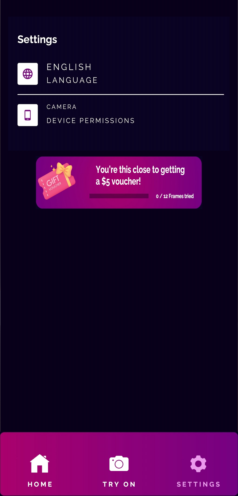</td>
  </tr>
</table>
<table>
  <tr>
    <td>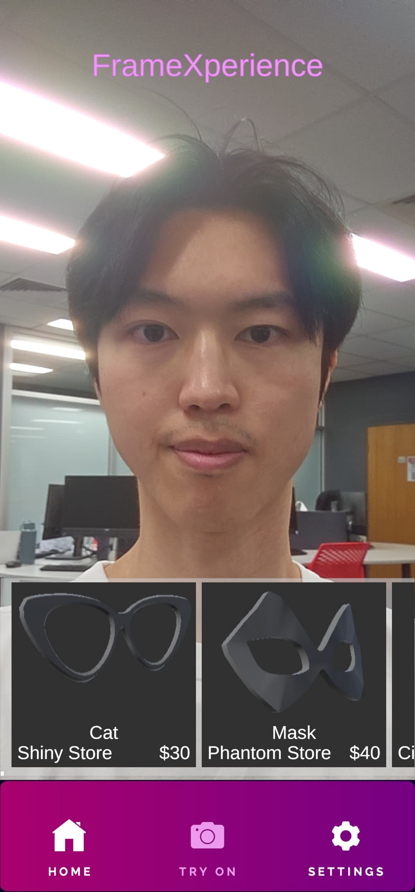</td>
    <td>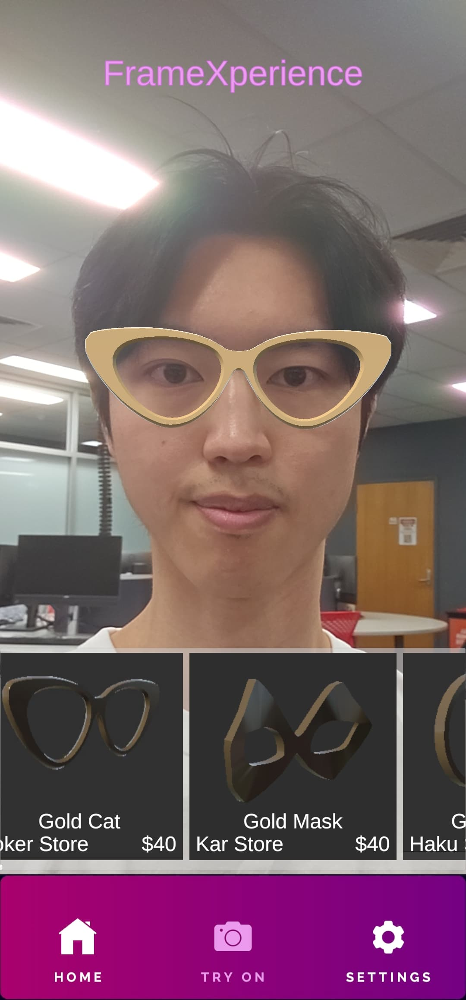</td>
    <td>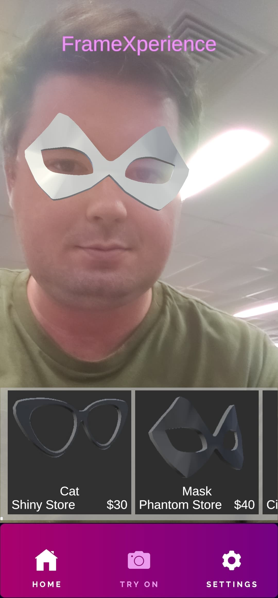</td>
    <td>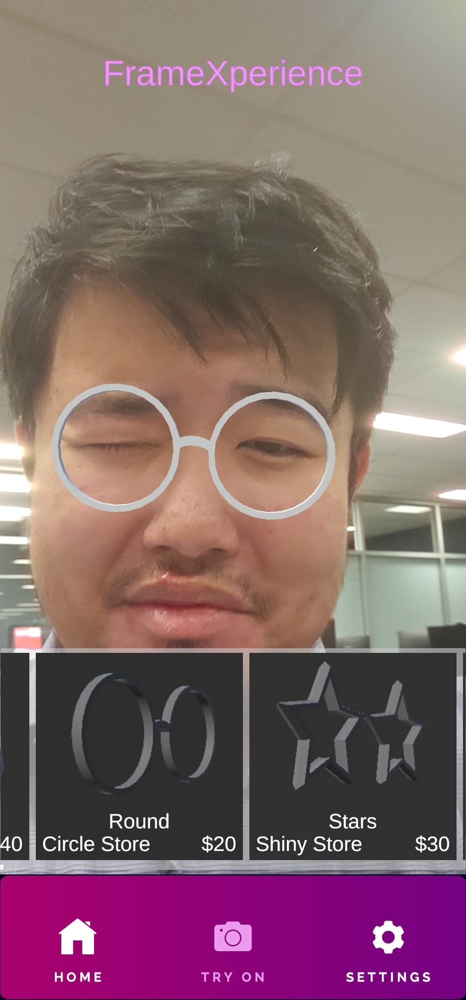</td>
  </tr>
</table>
<table>
  <tr>
    <td>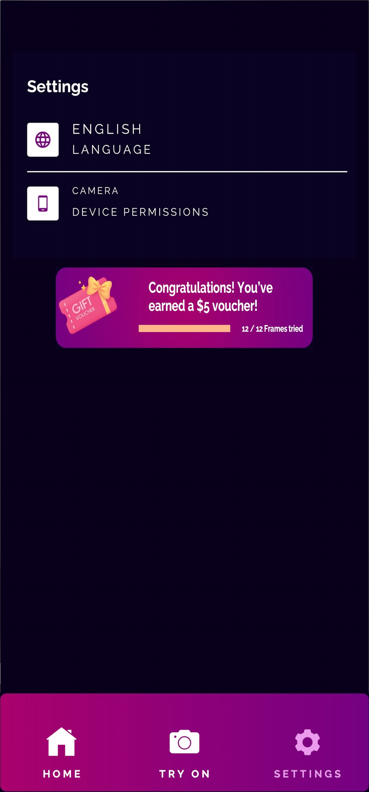</td>
    <td>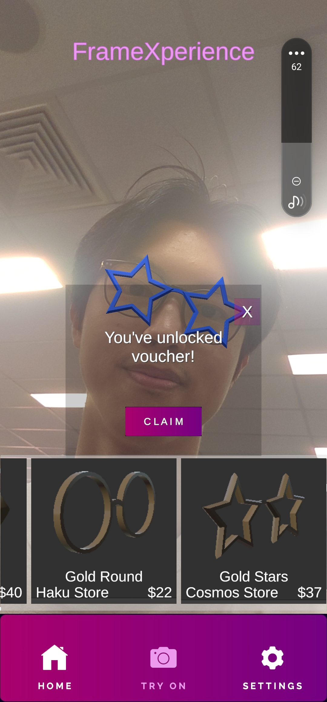</td>
    <td>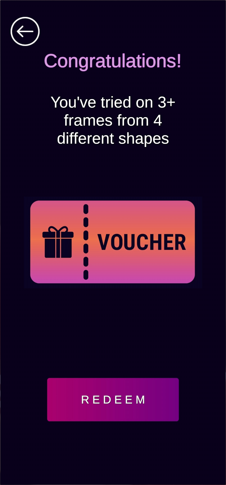</td>
    <td></td>
  </tr>
</table>

## Contributors:

Peh Jy Fung (jyfung.peh@griffithuni.edu.au),
Anon Kangpanich (anon.kangpanich@griffithuni.edu.au),
Patrick Carey (patrick.carey2@griffithuni.edu.au)

## Technologies Used

**1. Unity Game Engine**
Unity Game Engine is a widely used cross-platform game engine developed by Unity 
Technologies. It can be used on many different platforms including desktop, mobile, console, 
and AR/VR platforms. It can be used for 3D game development, 2D projects, XR projects, and 
multiplayer games.

Pros: Hussain et al. (2020) discussed that Unity is a tool with well-written documentation, 
a huge ecosystem, comprehensive support and a large community for AR development. 
Moreover, it has an extensive asset store that enables developers to prototype and iterate. 
Furthermore, it offers useful built-in tools for integrating markerless tracking and face 
detection.

Cons: Hussain et al. (2020) also discussed that Unity is not as ideal as other game 
engines for production of high-end graphical quality content. Low-end devices might also 
struggle to operate Unity games. Furthermore, while Unity offers a free version, the paid
version can be expensive. It also does not come with templates for projects and does not 
come with external code libraries.

**2. 3D Modeling and Asset Creation**
The application will create assets and make use of 3D models of glasses providing a 
realistic look of materials and textures.

Pros: Buyuksalih et al. (2017) explained that 3D Modeling and Asset Creation in Unity can 
create and refine 3D models of various objects, including glasses, and can provide realistic 
materials and textures. It can give full control on the quality of 3D assets and allow assets to 
be tailored to specific style and branding needs.

Cons: Buyuksalih et al. (2017) explained 3D modeling in Unity requires developers to 
manage memory and optimise assets carefully to mitigate memory consumption. Moreover, 
there is a high learning curve to master the advanced features.

**3. Markerless Face Tracking**
Typically, in animation, markers are used on the human face to carefully track facial 
movements. Markerless face tracking refers to technology that can track facial movement by 
camera without the use of markers.

Pros: Brito and Stoyanova (2018) explained that markerless face tracking has numerous 
advantages. It has no requirement for physical markers on the face. It requires very little setup 
for the user to begin using, only requiring a phone camera. Lastly, depending on the specific 
technology used, there is potential for high accuracy in facial movements.

Cons: Brito and Stoyanova (2018) also described the various disadvantages of using 
markerless face tracking. The effectiveness of the technology is heavily dependent on the 
level of light that is available, and low levels of background light can poorly affect the capability 
of the technology. There are also limitations on the complexity of the facial movements that 
the technology can track in comparison to markered face tracking.

## Frameworks

**1. AR Foundation**

Pros: AR Foundation offers every GameObjects and classes required to develop 
interactive AR experiences in Unity. It provides markerless AR tracking and face tracking 
features, which supports the function of virtual try-on experience on FrameXperience. It 
manages camera, detection and rendering seamlessly within Unity. It is Unity’s official 
package which comes with consistent updates and integration. Moreover, it simplifies multi￾platform AR development (AR Foundation, 2025).

Cons: Each AR Foundation provider is limited to a certain range of devices only. It requires 
additional optimisation for older or less capable devices (AR Foundation, 2025).

**2. Google ARCore XR Plugin**

Pros: ARCore is an Android AR framework that communicates with ARCore to get AR 
features on Android devices. ARCore integrates virtual content with the real world as seen 
through the user’s phone camera through motion tracking, environmental understanding, and 
light estimation. It lets the device understand and track its position in accordance with the 
world. Moreover, it allows the device to detect the size and location of all types of surfaces. 
Furthermore, it enables estimation of the environment’s current lighting conditions (Google 
ARCore XR Plug-in, 2025).

Cons: ARKit is better than ARCore when it comes to the development of augmented and 
virtual reality apps. ARCore does not support as many features of the AR Foundation as ARKit 
(Google ARCore XR Plug-in, 2025).
